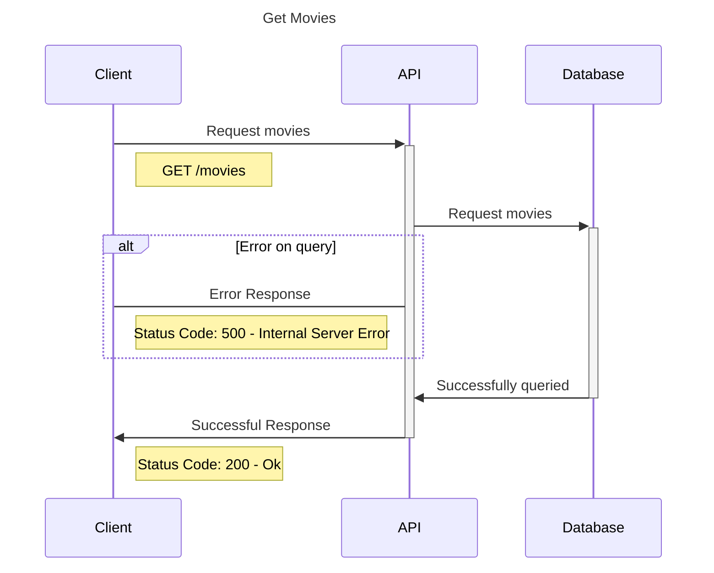

# Movie Service

## Stack da API

Primeiro você precisa do `pyenv` e do `poetry`, para gerenciar o `python` e o ambiente virtual, respectivamente. Caso não tenha instalado, aqui está uma [documentação](https://github.com/nayannanara/poetry-documentation) para te ajudar.

Em seguida, execute:

``` shell
pyenv local 3.12
poetry env use 3.12
poetry install
```

Crie um arquivo `.env` e insira as credenciais de `local.env`

Execute também para instalar o `pre-commit`:

Caso não queira utilizar o `poetry`, na raiz do projeto tem o arquivo requirements.txt; basta apenas criar um ambiente virtual normalmente e instalar as dependências.

```shell
make precommit
```

Para subir o banco de dados, caso não tenha o [docker](https://docs.docker.com/engine/install/ubuntu/) e o [docker-compose](https://docs.docker.com/compose/install/linux/) instalado, faça a instalação e logo em seguida, execute:

```bash
docker-compose up -d
```

## Banco de Dados
Para criar o banco de dados está sendo utilizando o Alembic para estruturar as migrations. Execute:

```bash
make run-migrations
```
Caso, necessite criar uma migration, execute:

```bash
make create-migrations description="descricao_do_que_foi_feito"
```

## Extração de dados

Após criar o banco, para termos dados em nosso banco de dados, execute:
```bash
make start-scraper
```

Este comando ativa um robô que fará a extração de dados no site `Adoro Cinema`, especificamente nos filmes infantis.

Exemplo de um dado extraído:
```json
{
    "title": "Vida de Inseto",
    "release_date": "18 de dezembro de 1998",
    "duration": "1h 35min",
    "kinds": "Aventura, Animação, Comédia",
    "directors": "John Lasseter, Andrew Stanton",
    "cast": "Dave Foley, Kevin Spacey, Julia Louis-Dreyfus",
    "original_title": "A Bug's Life",
    "note": 4.3,
    "description": "Todo ano, os gananciosos gafanhotos exigem uma parte da colheita das formigas. Mas quando algo dá errado e a colheita destruída, os gafanhotos ameaçam atacar e as formigas são forçadas a pedir ajuda a outros insetos para enfrentá-los numa batalha."
}
```

## Diagrama de sequência
#### Diagrama de listagem de filmesm infantis



## API

Para subir a API, execute:
```bash
make run
```
e acesse: http://127.0.0.1:8000/docs

A API contém apenas um endpoint, sendo ele:

### GET - Movies

_Request_:

```bash
curl -X 'GET' \
  'http://localhost:8000/movies?offset=0&limit=2' \
  -H 'accept: application/json'
```

_Response_:
```json
{
  "count": 2,
  "next": "http://localhost:8000/movies?limit=2&offset=2",
  "previous": "http://localhost:8000/movies?limit=2&offset=0",
  "results": [
    {
      "id": "f9f8140b-4fd5-495c-8c75-ba7b55cb45cb",
      "created_at": "2024-06-10T09:49:26.363288",
      "title": "Batman & Robin",
      "release_date": "4 de julho de 1997",
      "duration": "2h 05min",
      "kinds": "Ação, Fantasia, Suspense",
      "directors": "Joel Schumacher",
      "cast": "George Clooney, Arnold Schwarzenegger, Chris O'Donnell",
      "original_title": null,
      "note": 2,
      "description": "A dupla dinâmica enfrenta uma terrível dupla de vilões: o gélido Mr. Freeze (Arnold Schwarzenegger) e a delicada botânica que, ao sofrer um acidente, transforma-se na perigosa e vingativa Hera Venenosa (Uma Thurman). Mas, para poder livrar Gotham City das garras dos vilões, Batman (George Clooney) e Robin (Chris O'Donnell) contam com uma nova ..."
    },
    {
      "id": "58b962d7-ef63-49a8-a6f4-15e71cdd00d6",
      "created_at": "2024-06-10T09:50:35.319993",
      "title": "Monstros Vs. Alienígenas",
      "release_date": "3 de abril de 2009",
      "duration": "1h 33min",
      "kinds": "Animação",
      "directors": "Rob Letterman, Conrad Vernon",
      "cast": "Reese Witherspoon, Seth Rogen, Hugh Laurie",
      "original_title": "Monsters vs. Aliens",
      "note": 3.9,
      "description": "Susan Murphy (Reese Witherspoon) está prestes a se casar com Derek Dietl (Paul Rudd), um repórter de TV que sonha em ascender profissionalmente. No dia de seu casamento ela é atingida por um meteorito, oriundo de um planeta que explodiu recentemente. A radioatividade do objeto espacial faz com que ela cresça até a altura de 15 metros. Sem ..."
    }
  ]
}
```

## Flow
Para executar um `Flow`, rode o comando:

```bash
make start-flow
```
A ideia do Flow está bem simples. Consome a API local, portanto você precisa executar o `make run`antes do flow. Após pegar os dados vindos da API é criado um arquivo csv na raiz do projeto, chamado: `movies_output.csv`.


## Executar testes

Para executar os testes, execute:

```bash
make test
```

Caso queira executar um teste específico, execute:

```bash
make test-matching K=nomedoteste
```

obs.: alguns testes que não estão `mockados`, estão utilizando o banco de dados, portanto, caso execute o comando pra rodar os testes, o banco de dados será limpo; devido a fixture `db_session`.
